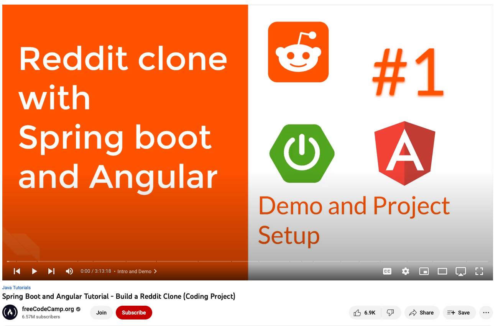

# Spring Boot Reddit Clone Backend [](https://github.com/spencerlepine/spring-reddit-workshop/actions/workflows/build.yml)

Reddit clone built using Spring Boot, Spring Security with JPA Authentication, Spring Data JPA with MySQL, Spring MVC. The frontend is built using Angular - You can find the frontend source code here - [https://github.com/spencerlepine/angular-reddit-workshop](https://github.com/spencerlepine/angular-reddit-workshop)




### ⚙️ Local Development Setup

> _Prerequisites_: 
>    - [JDK v11](https://www.oracle.com/java/technologies/downloads/), running [MySQL](https://hub.docker.com/_/mysql) database, and [Mailtrap](https://mailtrap.io) account

```shell
git clone https://github.com/spencerlepine/spring-reddit-workshop
cd spring-reddit-workshop
mvn clean install
mvn spring-boot:run
# API running on localhost:8080
```

#### API Endpoint Examples w/ Postman

Import the [postman_collection.json](./spring-reddit-clone.postman_collection.json) file into the [Postman](https://www.postman.com) workspace. 

### 📜 Links
- YouTube tutorial: [https://www.youtube.com/watch?v=DKlTBBuc32c](https://www.youtube.com/watch?v=DKlTBBuc32c)
- Tutorial Repository Backend: [https://github.com/SaiUpadhyayula/spring-reddit-clone](https://github.com/SaiUpadhyayula/spring-reddit-clone)
- Tutorial Repository Frontend: [https://github.com/SaiUpadhyayula/angular-reddit-clone](https://github.com/SaiUpadhyayula/angular-reddit-clone)
